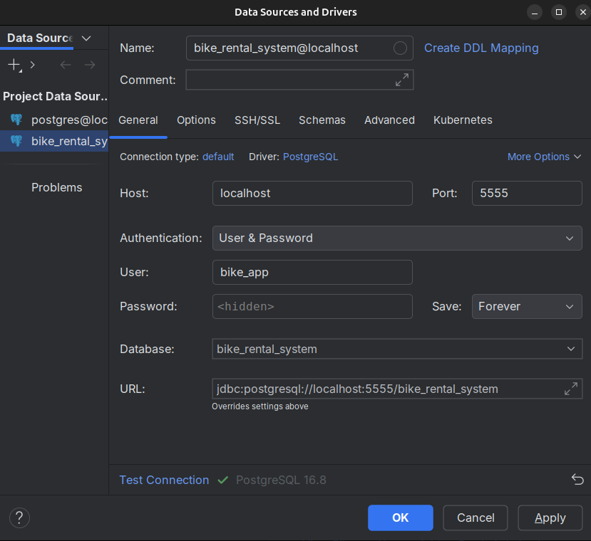

## Index
- [Index](#index)
- [Prerequisites](#prerequisites)
- [Environment Variables](#environment-variables)
- [Running PostgreSQL](#running-postgresql)
- [Connecting to the database](#connecting-to-the-database)
- [Connecting to the database in IntelliJ](#connecting-to-the-database-in-intellij)
- [How to establish database connection](#how-to-establish-database-connection)
- [Running tests](#running-tests)

## Prerequisites

- Docker and Docker Compose installed on your machine. ([docs how to install](https://docs.docker.com/engine/install/))

- Host port 5555 must be free before starting the database container.

## Environment Variables

Copy the example file:
```bash
cp .env.example .env

```

Open `.env` and fill in _POSTGRES_PASSWORD_ secret value.

## Running PostgreSQL

Start the database service in detached mode:

```bash
docker compose up -d
```

## Connecting to the database

Use the psql client to connect:

```bash
psql -h localhost -p 5555 -d bike_rental_system -U bike_app -W
```

You will be prompted for the password you set in your `.env` file.

## Connecting to the database in IntelliJ
In IntelliJ IDEA, add a new PostgreSQL data source with the following settings:
- Host: _localhost_
- Port: _5555_
- Database: _bike_rental_system_
- User: _bike_app_
- Password: (enter the password from your `.env` file)


## How to establish database connection

Option 1: Copy `.env` to `src/main/resources/.env`
```bash
cp .env src/main/resources/.env
```

Option 2: Set Environment Variables:

If using bash for building project:
Run these commands:
```bash
export POSTGRES_USER=bike_app
export POSTGRES_PASSWORD=lets_dont_care_about_secur1ty
export POSTGRES_DB=bike_rental_system
```
If using IntelliJ for building project:

    Go to Run → Edit Configurations.

    Select your Spring Boot run configuration.

    Click Modify Options → Environment Variables.

    Add: POSTGRES_USER=bike_app;POSTGRES_PASSWORD=password_from_.env;POSTGRES_DB=bike_rental_system

Apply changes, click ok and restart the app.

## Running tests

[See the testing README](src/test).
