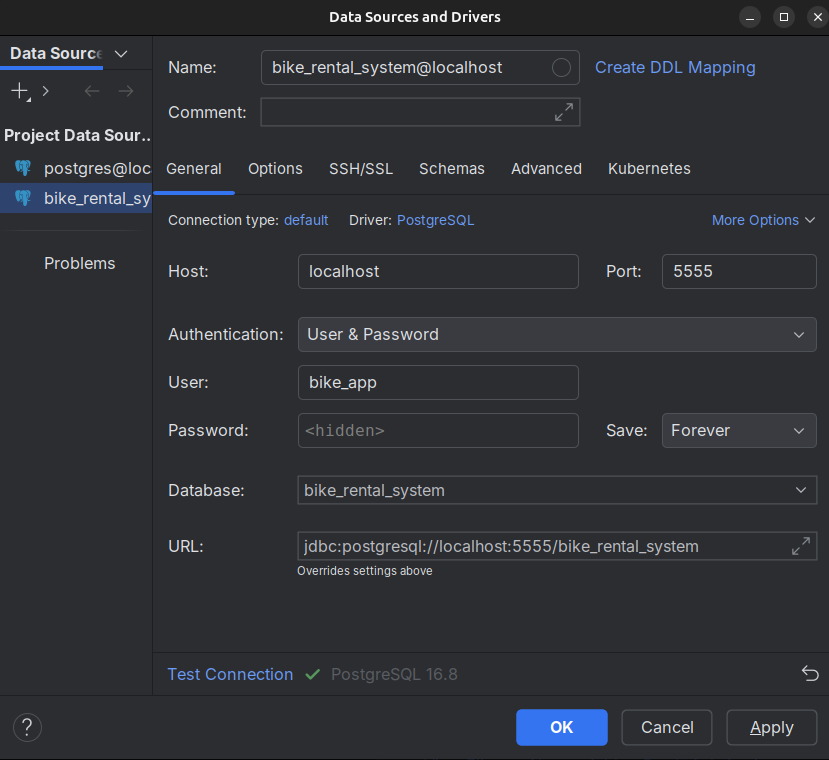

## Prerequisites

- Docker and Docker Compose installed on your machine. ([docs how to install](https://docs.docker.com/engine/install/))

- Host port 5555 must be free before starting the database container.

## Environment Variables

Copy the example file:
```bash
cp .env.example .env

```

Open `.env` and fill in _POSTGRES_PASSWORD_ secret value.

## Running PostgreSQL

Start the database service in detached mode:

```bash
docker compose up -d
```

## Connecting to the database

Use the psql client to connect:

```bash
psql -h localhost -p 5555 -d bike_rental_system -U bike_app -W
```

You will be prompted for the password you set in your `.env` file.

## Connecting to the database in IntelliJ
In IntelliJ IDEA (or DataGrip), add a new PostgreSQL data source with the following settings:
- Host: _localhost_
- Port: _5555_
- Database: _bike_rental_system_
- User: _bike_app_
- Password: (enter the password from your `.env` file)
