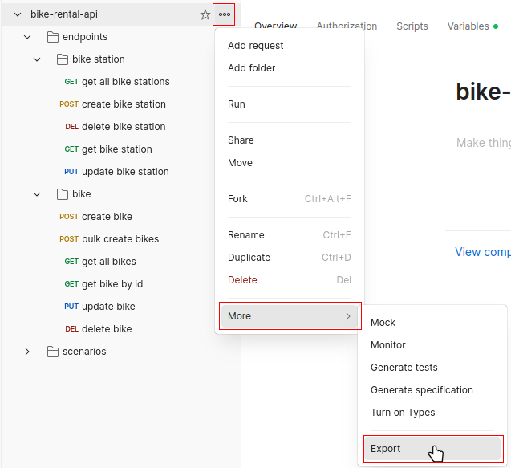
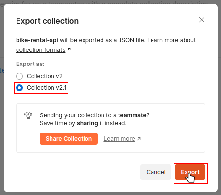

## Index
- [Index](#index)
- [Prerequisites](#prerequisites)
- [API tests with Postman](#api-tests-with-postman)
  - [Exporting Postman collection](#exporting-postman-collection)
- [Java](#java)

## Prerequisites

- [Postman](https://www.postman.com/downloads/).

## API tests with Postman

1. Import the [Postman collection](postman/bike-rental-api.postman_collection.json) by dragging it into Postman:

2. Pick and choose which tests you wish to run. Tests are split into endpoint (unit) and scenario (integration) tests.

### Exporting Postman collection

1. In Postman, select additional options of the collection, and navigate to the export menu;

2. Select the Collection v2.1 version and export it;

3. A file selection menu will appear. Select where to export and the file name of the exported collection.

## Java

Currently unimplemented.
