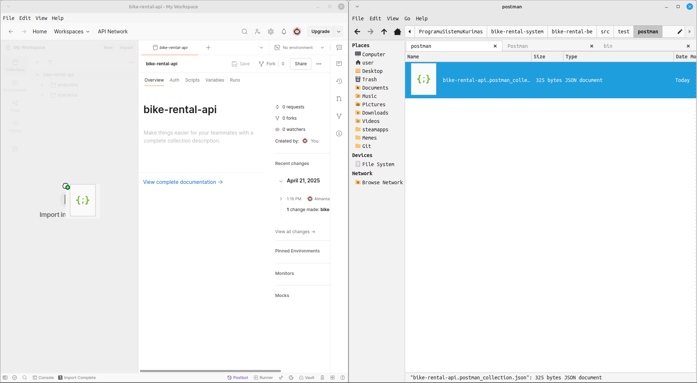

## Prerequisites

- [Postman](https://www.postman.com/downloads/).

## Running tests

### Postman

1. Import the [Postman collection](postman/bike-rental-api.postman_collection.json) by dragging it into Postman:

2. Pick and choose which tests you wish to run. Tests are split into endpoint (unit) and scenario (integration) tests.

### Java

Currently unimplemented.
